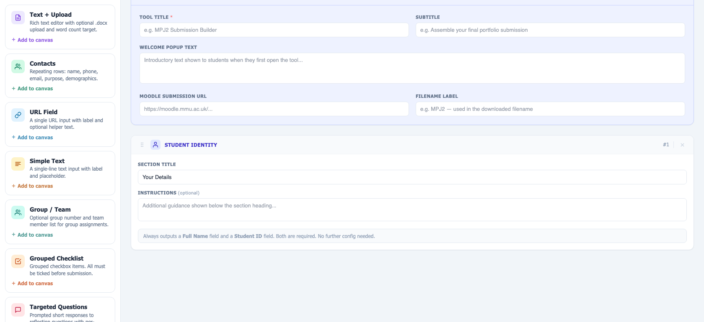

# Submission Builder

A single‑file, browser‑based tool for building student submission forms.

**Submission Builder Builder** lets a staff member visually assemble a submission
form from a palette of blocks — student identity, a reflective write‑up, contact
details, checklists, links, an AI‑use declaration, and more — and then export it
as one self‑contained HTML file. Students open that file, fill it in, and it
generates a single, standardised Word document containing every required element
of their submission.

## Why

- **Complete submissions.** The generated form tracks progress per section and
  won't let a student download until every required part is done.
- **Reflection, not rush.** Word‑count targets, targeted reflection prompts and a
  structured layout encourage students to think about what they are handing in.
- **Standardised format.** Every submission comes back as the same document
  shape, and the form records metadata (generation time, links, word counts, AI
  disclosure, group details) so a cohort can be checked and analysed quickly.

## How it works

### For staff — build a form

1. Open [`builder-builder.html`](builder-builder.html) in a browser.
2. Fill in **Form Configuration** — tool title, subtitle, welcome pop‑up text,
   Moodle submission URL and the label used in the downloaded filename.
3. Click blocks in the left‑hand **Block Palette** to add them to the canvas.
   Drag the grip handle (or use the ▲▼ buttons) to reorder; expand a block to
   configure its title, help text, requirements and options.
4. **Preview** shows the student form; **Export HTML** downloads the finished
   standalone form.
5. **Schema / Load** save and restore the build as a JSON file. Work also
   autosaves to the browser's local storage.

### For students — complete a submission

1. Open the exported HTML file in a browser (no install, works offline).
2. Work through the sections. Progress is shown in a sidebar; word‑count meters
   and validation flag anything incomplete.
3. Text sections accept typed input or a `.docx` upload (parsed in‑browser).
   "Preview doc" renders the document without downloading.
4. When every required section is complete, download the submission as
   `{StudentID}_{Name}_{Label}_Submission.docx`.

## Block types

| Block | Purpose |
| --- | --- |
| **Student Identity** | Full name and student ID. Always present as the first section. |
| **Text + Upload** | Rich‑text editor with optional `.docx` upload and a word‑count target. |
| **Contacts** | Repeating rows: name, organisation, role, phone, email, purpose, demographics. |
| **URL Field** | A single labelled URL input with optional helper text. |
| **Simple Text** | A single‑line text input with label and placeholder. |
| **Group / Team** | Optional group number and team‑member list for group assignments. |
| **Grouped Checklist** | Grouped checkbox items; all must be ticked before submission. |
| **Targeted Questions** | Prompted short responses with per‑prompt word counts. |
| **AI Use Disclosure** | Configurable AI declaration — prohibited, permitted with structured disclosure, or optional disclosure. |
| **Info / Divider** | Staff‑written heading and guidance. No student input; not assessed. |

## Technical notes

- **No build step, no backend.** `builder-builder.html` is the whole application.
  Everything runs client‑side; nothing is uploaded anywhere.
- Runtime dependencies are loaded from CDNs: Tailwind CSS for styling, and
  [mammoth.js](https://github.com/mwilliamson/mammoth.js) in the generated forms
  for reading `.docx` uploads.
- Exported forms persist in‑progress work to `localStorage`, so a refresh or
  crash doesn't lose a student's answers.
- Builder schemas carry a `schemaVersion` field for future migration.

## Repository contents

| Path | Description |
| --- | --- |
| `builder-builder.html` | The tool. Open this to build forms. |
| `assets/screenshot.png` | Screenshot used in this README. |

Other working files in this folder are intentionally left untracked for now (see
`.gitignore`).

## Versioning

The build number is shown next to the title in the builder header and is
incremented on every change to `builder-builder.html` (currently **v1.9**).
